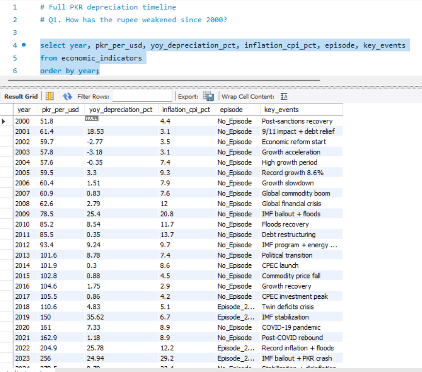
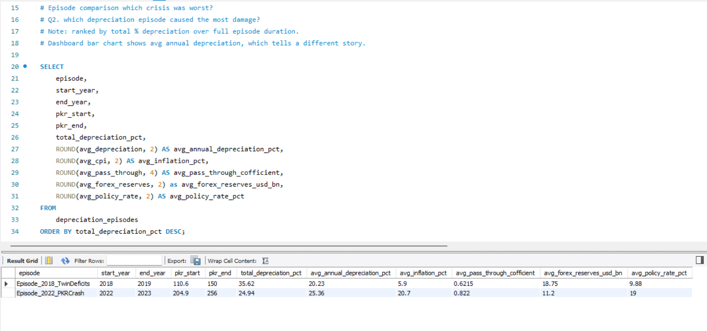
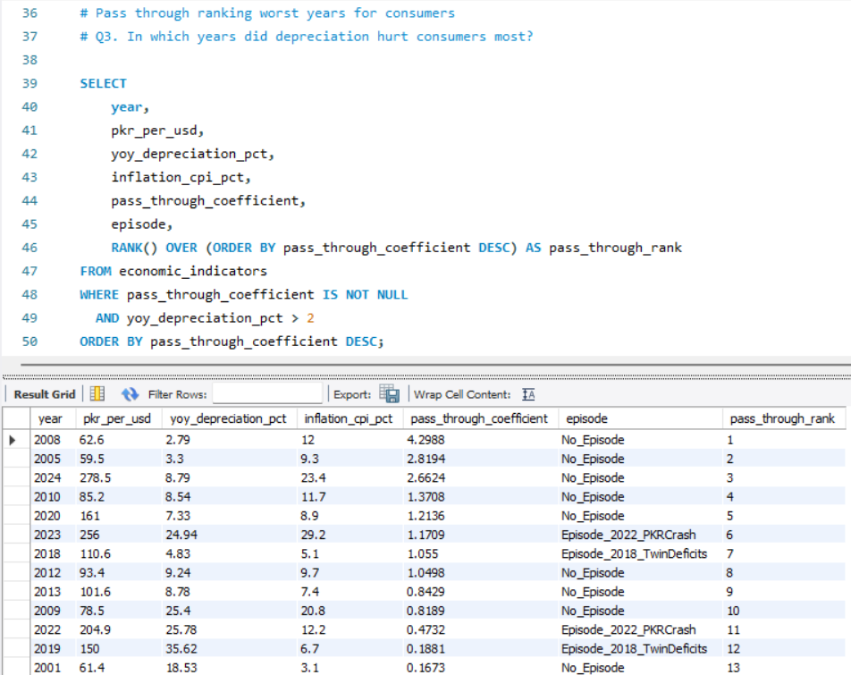
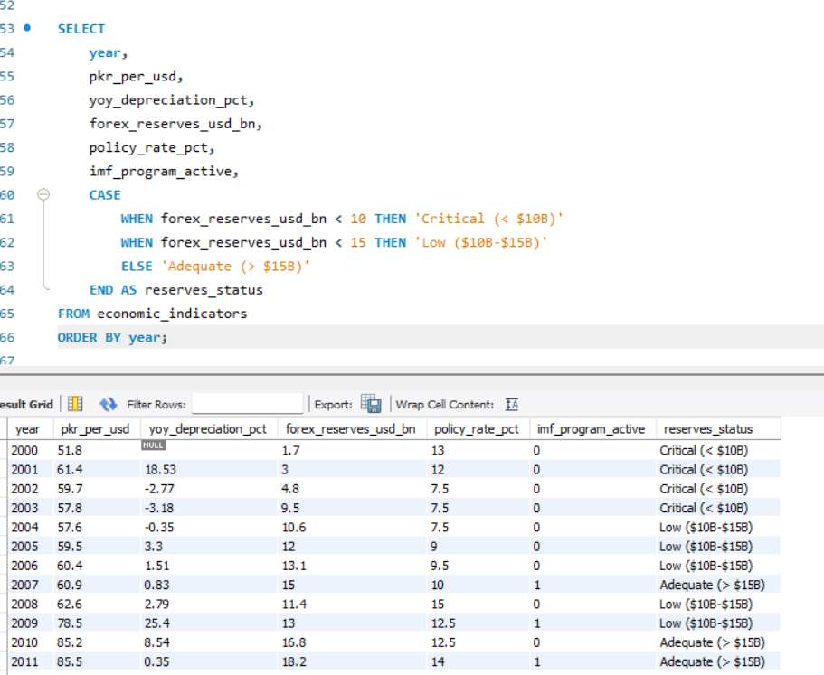
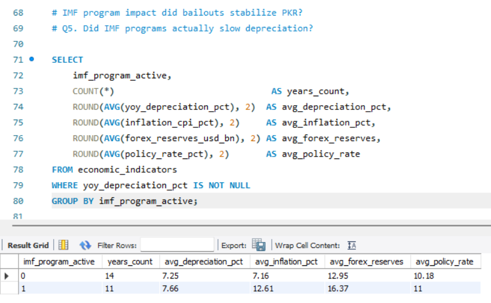
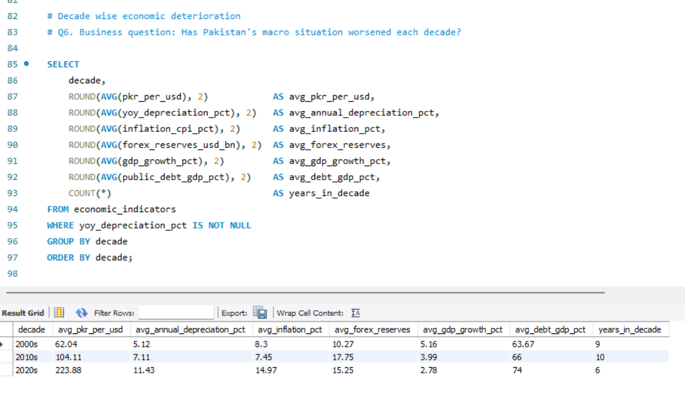
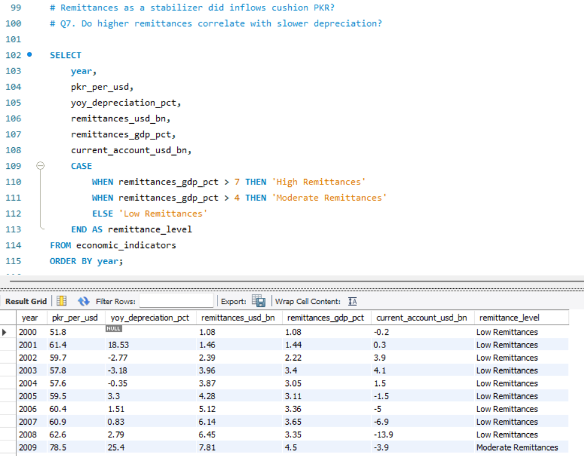
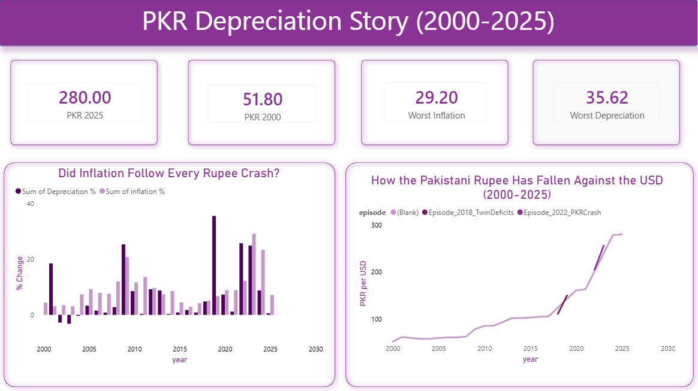
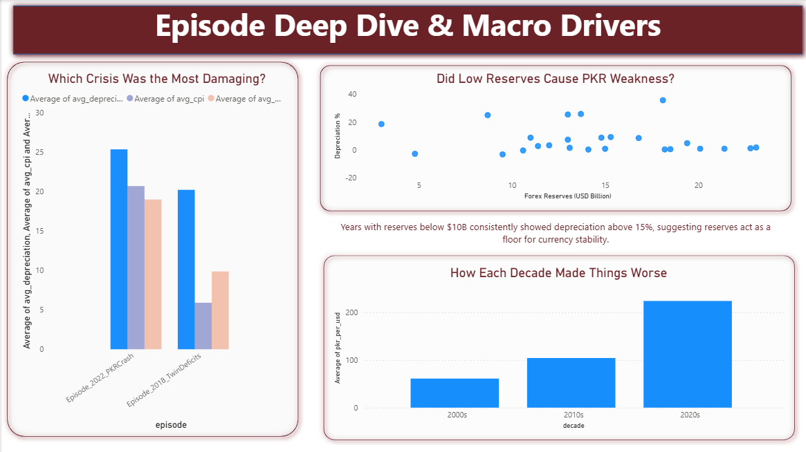

# PKR vs USD: How Rupee Crashes Became Inflation (2000-2025)

**Tools:** Python · MySQL · Power BI  
**Data:** 26 years · 32 indicators · 3 crisis episodes  
**Skills shown:** Data cleaning · Feature engineering · SQL window functions · Dashboard design

---

## The One-Line Summary

Every time the Pakistani rupee crashed, ordinary people paid for it through higher prices.  
This project tracks exactly when, how much, and why across 25 years of data.

---

## The Problem

Pakistan has faced three major currency crises since 2000.  
Each time the rupee weakened, inflation followed but no one had clearly mapped:

- Which crisis caused the most damage?
- How much of each rupee crash actually reached consumer prices?
- Did IMF bailouts help or not?
- Did foreign reserves protect the currency?

This project answers all four questions with data.

---

## The Dataset

**Source:** Pakistan Economic Indicators 2000-2025 (Kaggle)  
**Coverage:** 2000 to 2025 · 26 rows · 32 columns

Key columns used:

| Column | What It Means |
|---|---|
| `pkr_per_usd` | How many rupees buy one dollar |
| `inflation_cpi_pct` | How much prices rose that year |
| `forex_reserves_usd_bn` | Pakistan's dollar savings |
| `imf_program_active` | Whether a bailout was active |
| `remittances_usd_bn` | Money sent home by overseas Pakistanis |

---

## What I Built

### Step 1 : Python: Clean + Engineer Features
**File:** `pkr_depreciation.ipynb`

Started with raw CSV. Added three columns that did not exist:

**Year-over-year depreciation**  
How much weaker did the rupee get this year vs last year?
```
yoy_depreciation_pct = pct_change(pkr_per_usd) x 100
```

**Pass-through coefficient** (the key metric of this project)  
Of every 1% the rupee fell, how much became inflation?
```
pass_through_coefficient = inflation_cpi_pct / yoy_depreciation_pct
```
A value of 2.0 means: for every 1% rupee fall, prices rose 2%. Higher = more pain for consumers.

**Episode labels**  
Tagged each year with its crisis context:
- `Episode_2018_TwinDeficits` covers 2018 to 2019
- `Episode_2022_PKRCrash` covers 2022 to 2023
- `No_Episode` for all other years

Then pushed everything to MySQL.

---

### Step 2 : MySQL: 7 Business Questions
**File:** `pkr_depreciation_SQL.sql`

---

**Q1. How has the rupee weakened since 2000?**

Full timeline from PKR 51.8 in 2000 to PKR 280 in 2025.



---

**Q2. Which depreciation episode caused the most damage?**

Ranked episodes by total depreciation across the full crisis period.

| Episode | PKR Start | PKR End | Total Fall |
|---|---|---|---|
| Episode_2018_TwinDeficits | 110.6 | 150.0 | **35.62%** |
| Episode_2022_PKRCrash | 204.9 | 256.0 | **24.94%** |

> Note: The bar chart in the dashboard ranks by average annual depreciation, which is a different measure. Both views are valid and tell different stories.



---

**Q3. In which years did depreciation hurt consumers most?**

This question has two answers, depending on whether inflation was driven by currency movement or by domestic factors.

**Years where inflation spiked despite a stable rupee** these show supply shocks and energy prices play an independent role:

| Year | Depreciation | Inflation | Likely Driver |
|---|---|---|---|
| **2011** | 0.35% | 13.7% | Debt restructuring + energy costs |
| **2014** | 0.30% | 8.6% | Domestic supply pressures |
| **2025** | 0.54% | 7.2% | Post-stabilization price stickiness |

**Years with the highest pass-through from depreciation to inflation** filtering for years with >2% depreciation to avoid mathematical outliers:

| Rank | Year | Depreciation | Inflation | Pass-Through Coefficient |
|---|---|---|---|---|
| 1 | **2008** | 2.79% | 12.0% | **4.30** |
| 2 | **2005** | 3.30% | 9.3% | **2.82** |
| 3 | **2024** | 8.79% | 23.4% | **2.66** |
| 4 | **2010** | 8.54% | 11.7% | 1.37 |
| 5 | **2020** | 7.33% | 8.9% | 1.21 |

> **Note:** The pass-through coefficient divides inflation by depreciation. When depreciation is near zero (e.g., 2011, 2014), the ratio becomes economically meaningless, so those years are better interpreted as "high inflation despite currency stability" rather than extreme pass-through. The 2008 Global Financial Crisis tops the filtered list a modest rupee fall coincided with a major inflation spike as global commodity prices surged.



---

**Q4. Did low reserves cause PKR weakness?**

Bucketed reserve levels into three categories and tracked depreciation at each level.

| Reserves Status | What It Means |
|---|---|
| Critical (< $10B) | Danger zone, country can barely cover imports |
| Low ($10B to $15B) | Vulnerable |
| Adequate (> $15B) | Stable buffer |

Finding: years with critical reserves consistently showed the largest depreciation spikes.



---

**Q5. Did IMF programs actually slow depreciation?**

| IMF Active | Avg Depreciation | Avg Inflation |
|---|---|---|
| No (0) | 7.25% | 7.16% |
| Yes (1) | 7.66% | 12.61% |

IMF years show higher depreciation and inflation but this does not mean IMF programs failed.  
Pakistan goes to the IMF because things are already bad. The causality runs backwards.



---

**Q6. Has Pakistan's macro situation worsened each decade?**

| Decade | Avg PKR | Avg Depreciation | Avg Inflation | Avg GDP Growth | Avg Debt/GDP |
|---|---|---|---|---|---|
| 2000s | 62.04 | 5.12% | 8.30% | 5.16% | 63.67% |
| 2010s | 104.11 | 7.11% | 7.45% | 3.99% | 66.00% |
| 2020s | 223.88 | 11.43% | 14.97% | 2.78% | 74.00% |

Most macro indicators deteriorated over time, with the 2020s showing the sharpest decline. Currency weakened, growth slowed, and debt rose every decade. However, the 2010s saw two notable exceptions: average inflation was lower than the 2000s (7.45% vs. 8.30%) and forex reserves were stronger ($17.75B vs. $10.27B), before both reversed in the 2020s.



---

**Q7. Do higher remittances cushion the rupee?**

Categorised each year by remittance level as % of GDP and compared depreciation.

Finding: high remittance years did not consistently prevent depreciation but they likely slowed it during the 2022 to 2023 crisis when Pakistan urgently needed dollar inflows.



---

### Step 3 : Power BI: Two Dashboards

**Dashboard 1: PKR Depreciation Story (2000-2025)**



Covers the full 25-year arc. Shows when inflation followed rupee crashes and when it did not.

**Dashboard 2: Episode Deep Dive and Macro Drivers**



Zooms into the crisis episodes. Compares average depreciation, inflation, and policy rate. Includes the reserves scatter and decade deterioration chart.

---

## Key Findings

1. **The dollar strengthened 440% against the rupee from 2000 to 2025**, meaning the rupee lost over 80% of its purchasing power.
2. **2019 was the single worst depreciation year** at 35.62% in one year.
3. **2023 was the worst inflation year** at 29.2%, driven by the PKR crash plus energy price hikes.
4. **Pass-through is not automatic.** Several years had high inflation with almost no depreciation, meaning domestic supply and energy policy matter independently.
5. **Most macro indicators deteriorated over time**, with the 2020s showing the sharpest decline. The 2010s saw two notable exceptions: lower average inflation (7.45%) and higher forex reserves ($17.75B) compared to the 2000s.
6. **IMF years correlate with worse outcomes** but that reflects crisis entry conditions, not program failure.

---

## How to Run This Yourself

**Python:**
1. Install requirements: `pip install pandas sqlalchemy mysql-connector-python`
2. Place `pakistan_economic_indicators_2000_2025.csv` in the same folder
3. Run all cells in `pkr_depreciation.ipynb`

**MySQL:**
1. Make sure MySQL is running locally
2. Update credentials in the notebook (DB_USER, DB_PASSWORD)
3. Notebook auto-creates the database and both tables
4. Open `pkr_depreciation_SQL.sql` in MySQL Workbench and run queries

**Power BI:**
1. Open the .pbix file
2. Update MySQL connection string to your local credentials
3. Refresh data

---

## About Me

I am a data analytics student building real projects on real data.  
This project is part of my portfolio tracking Pakistan's economic story through numbers.

[GitHub](https://github.com/aiman-ami) · [LinkedIn](https://linkedin.com/in/aiman-ishaq)
